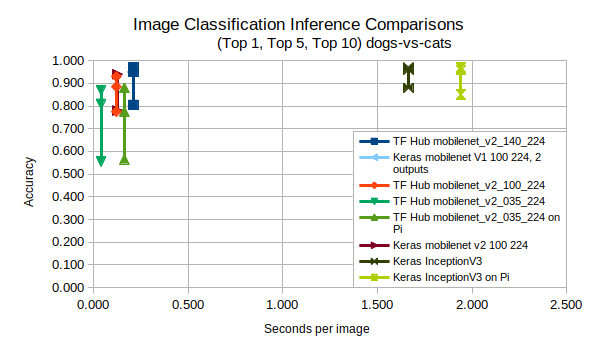

Building an Image Classifier with Tensorflow, running on a Pi
==============================================================

Starting with Ubuntu 18.04 to train the neural net, and convert to
tensorflow-lite, which will run on Raspian Stretch.

# Installing TensorFlow on an Older Desktop

## Things that did not work

### Installing with pip
Installing with pip completes, but on old hardware, this fails to run.
Version 1.50 and earlier are compiled without AVX instructions, which will work
on older hardware. However, TensorFlow Lite requires much newer releases.

    sudo apt install python3-pip libcublas9.1
    pip3 install tensorflow==1.5.0
    #wget https://github.com/schrepfler/tensorflow-community-wheels/releases/download/v1.12.0/tensorflow-1.12.0-cp36-cp36m-linux_x86_64.whl
    #pip3 install tensorflow-1.12.0-cp36-cp36m-linux_x86_64.whl
    
### Running with a docker image
Running Tensorflow from a docker image crashes (on older hardware). Probably 
because of AVX instructions?

    sudo apt install docker.io
    sudo adduser -aG docker $USER
    # completely logout and log back in, or reboot 
    
    docker pull tensorflow/tensorflow:nightly-devel
    docker volume create mydata      # Create someplace for the container to store stuff
    docker run -v mydata -it tensorflow/tensorflow:nightly-devel
    
    # From within the bash shell running in the docker container...
    # Note: the default for this image is to run as root
    apt-get update
    apt-get install crossbuild-essential-armhf
    cd /tensorflow
    ./tensorflow/lite/tools/make/download_dependencies.sh
    ./tensorflow/lite/tools/make/build_rpi_lib.sh

    # This should compile a static library in: `tensorflow/lite/tools/make/gen/lib/rpi_armv7/libtensorflow-lite.a`.

## Works: Compiling from source
So, that leaves us with compiling from source...

    # https://medium.com/@Oysiyl/install-tensorflow-1-8-0-with-gpu-from-source-on-ubuntu-18-04-bionic-beaver-35cfa9df3600
    sudo apt install build-essential cmake python3-dev
    sudo apt install libcupti-dev libcuda-9.1-1 nvidia-cuda-dev

    wget https://github.com/bazelbuild/bazel/releases/download/0.22.0/bazel-0.22.0-installer-linux-x86_64.sh
    chmod +x  bazel-0.22.0-installer-linux-x86_64.sh
    ./bazel-0.22.0-installer-linux-x86_64.sh

    git clone tensorflow
    cd tensorflow
    ./configure
    # The build process chews up too many resources (memory?), so we need to
    # dial it back wit hthe ram_utilization_factor and/or jobs options.
    #bazel build --config=opt //tensorflow/tools/pip_package:build_pip_package
    bazel build --ram_utilization_factor=40 --jobs=6 --config=opt //tensorflow/tools/pip_package:build_pip_package

    # Be sure to uninstall (with both pip3 and pip2) all old versions of
    # tensorflow, and probably delete caches in $HOME/.local/lib/python3.6/site-packages/tensorflow/
    # See: https://stackoverflow.com/questions/51299194/importerror-cannot-import-name-abs
    bazel-bin/tensorflow/tools/pip_package/build_pip_package tensorflow_pkg
    cd tensorflow_pkg
    pip3 install --upgrade --no-cache tensorflow*.whl

    # Verify the install
    python3
    import tensorflow as tf
    hello = tf.constant('Hello, TensorFlow!')
    sess = tf.Session()
    print(sess.run(hello))

Note: *DO NOT* (pip3) install mxnet, it will mess up the tensorflow install

# Install Models

## Things that didn't work
Downloading the raw model and building it didn't work. It appears to be missing
a bazel workspace.

    #CHECKPOINT_DIR=/tmp/checkpoints
    CHECKPOINT_DIR=./checkpoints
    mkdir ${CHECKPOINT_DIR}
    wget http://download.tensorflow.org/models/mobilenet_v1_2018_02_22/mobilenet_v1_1.0_224.tgz
    tar -xvf mobilenet_v1_1.0_224.tgz
    mv mobilenet_v1_1.0_224.ckpt.* ${CHECKPOINT_DIR}

## Working: Install TensorFlow Hub

    pip3 install tensorflow_hub

# Links
- https://www.tensorflow.org/lite/guide/build_rpi
- https://github.com/tensorflow/models/blob/master/research/slim/nets/mobilenet_v1.md
- https://github.com/tensorflow/models/tree/master/research/slim/nets/mobilenet 
- https://www.tensorflow.org/hub/tutorials/image_retraining 
- https://www.tensorflow.org/tutorials/images/hub_with_keras
- https://github.com/schrepfler/tensorflow-community-wheels/releases/tag/v1.12.0
- https://www.tensorflow.org/lite/convert/python_api

# Kaggle Test Data
The data comes from:
- https://www.kaggle.com/c/dogs-vs-cats/data
- https://www.kaggle.com/c/dogs-vs-cats-redux-kernels-edition/data

These data sets are organized in the tree below, where labels are in the file
name.

    dogs-vs-cats
    ├── sampleSubmission.csv
    ├── test
    │   └── xxxx.jpg
    └── train
        ├── cat.xxxx.jpg
        └── dog.xxxx.jpg

However, for Keras to digest them, we need to use a directory structure to label
them. In the example below, loading the `train` directory with keras will have a
`dog` label and a `cat` label:

    dogs-vs-cats
    ├── sampleSubmission.csv
    ├── test
    │   └── xxxx.jpg
    ├── train
    │   ├── cat
    │   │   └── cat.xxxx.jpg # Note: name doesn't matter here
    │   └── dog
    │       └── dog.xxxx.jpg # Note: name doesn't matter here

# Running the scripts
- `tf_hello.py` simple 'Hello World' script, to verify that the TensorFlow
install is working.

- `tfhub_example.py` can be run from the command line. It calls `tfhub_test.py`.
It will load the mobile net model and test it on the dogs-vs-cats data.

- `tfhub_test.py` can be re-run multiple times, by starting ipython(3), running
`tfhub_example.py` once, and then running `tfhub_test.py` as many times as you
like, potentially modifying parameters each time.

- To run a script within ipython3, do something like:

    ```
    exec(open("./tfhub_test.py").read())
    ```

# Installing on Pi

    sudo apt install python3 python3-matplotlib python3-scipy
    pip3 install tensorflow tensorflow-hub

Running the scripts on the Pi is the same as running on the desktop.

# Results



[comment]: # (vim: ts=4:sw=4)
